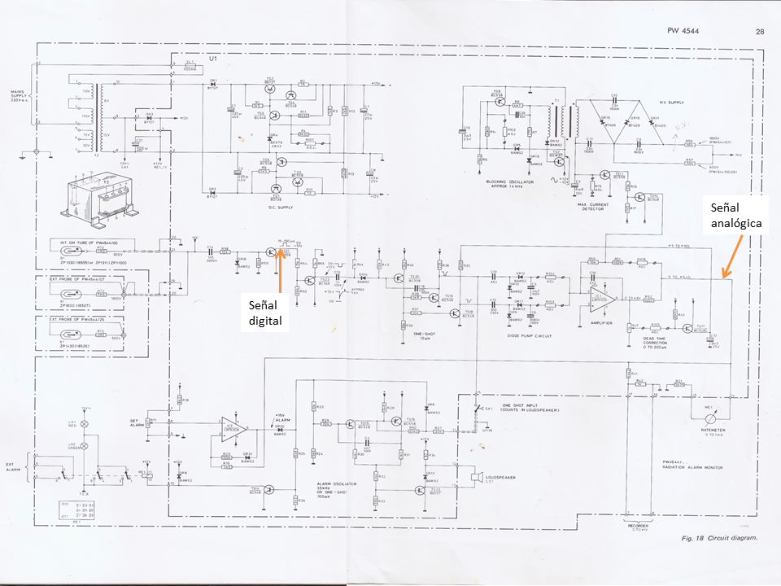
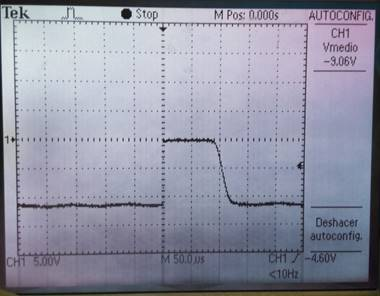

# Laboratorio remoto
Se desea realizar el montaje de dos experimentos relacionados con radiación gamma que serán monitoreados y controlados de forma remota.

### Descripción de los experimentos

- **Primer experimento**    
    
Se determina la relación entre la intensidad de la radiación gamma y la distancia que separa al detector de la muestra radiactiva. 

El detector que se utilizará es un detector de cámara de gas de tipo Geiger-Müller, este detector determina tasa de dosis, esta variable es proporcional a la intensidad de la radiación. 


El usuario verá en pantalla la imagen en tiempo real del experimento, el valor del voltaje aplicado al detector, la distancia entre la muestra y el detector, la ventana temporal en la que se llevará a cabo la medida y la intensidad registrada. Por otro lado, el estudiante fijará la distancia detector-muestra. Al finalizar la experiencia, los datos serán almacenados para que el usuario pueda realizar el análisis que desee.

- **Segundo experimento**

Se observa y caracteriza la atenuación de la radiación debido a su paso a través de la materia, usando láminas de Al y Pb. 

Manteniendo la distancia detector-muestra fija, el usuario interpone en este espacio láminas de dos materiales diferentes (aluminio y plomo) y selecciona el espesor de la lámina utilizada. En este caso, se estudia la relación existente entre el tipo de material y el espesor de este, con la intensidad de la radiación. 


Nuevamente, el usuario verá en pantalla la imagen en tiempo real del experimento, el valor del voltaje aplicado al detector, la distancia entre la muestra y el detector, el tipo de material de la lámina que se está usando como obstáculo y el espesor del mismo, la ventana temporal en la que se llevará a cabo la medida y la intensidad registrada. Mientras tanto, el estudiante fijará la distancia detector-muestra, el material de la lámina obstáculo y su espesor. Una vez culminado el tiempo de medida, los datos serán almacenados para que el usuario pueda realizar el análisis que desee.

### Desarrollo del proyecto
- **Tarjeta de desarrollo DemoQE128**

En esta tarjeta está instalado el Microcontrolador de *freescale* MC9S08QE128CLH. Esta tarjeta permite el control de todo el sistema, se le conectan las señales de los sensores, ella las digitaliza y las envia a la computadora por puerto serial. Así mismo, entrega las señales de giro a los motores y recibe las instrucciones del usuario para cambiar los parámetros del experimento.


- **Sensores**
    - Sensor de proximidad. Sharp GP2Y0A21YK [DataSheet][Sharp]
    
    Utilizado para determinar la distancia entre la muestra y el detector, su salida es analógica.
    
    - Detector de cámara de gas Geiger-Müller
    
    Permite medir la radiactividad de un objeto o lugar. El detector está formado por un tubo con un fino hilo metálico a lo largo de su eje (como un capacitor cilíndrico), el espacio entre ellos está aislado y relleno de un gas y el hilo central está conectado a alto voltaje, en este caso 450V, con respecto al tubo. Cuando un fotón de alta energía (gamma) atraviesa el tubo, éste ioniza el gas y los iones negativos se desplazan hacia el ánodo y los positivos hacia el cátodo. En su camino hacia el ánodo, los electrones continuan ionizando el gas y liberando aún más electrones que continuan con el proceso, esto se convierte en una avalancha que produce un pulso de corriente detectable. Por cada partícula que llega se produce un pulso idéntico, esto permite contar las partículas y es precisamente lo que se pretende. 
    
    Este sensor viene acompañado de un sistema electrónico que indica, con la deflexión de la aguja de un galvanómetro, los niveles de tasa de exposición. 
    
    
    
    De este sistema se tomarán dos señales
    
    **1)** Digital. Pulsos cuadrados de -12V de amplitud 
    
     
    
    Esta señal es empleada para contar la cantidad de fotones gamma que llegan al detector.
    
    **2)** Analógica, lectura de voltaje en el galvanómetro, esta señal es proporcional a los niveles de tasa de dosis que se registran en el equipo. Su amplitud está entre 200mV (sin fuente radiactiva) y 2.5V (con fuente radiactiva a la mínima distancia).
    
    - Láser con Fototransistor
    
    En el segundo experimento se van a interponer láminas de dos metales de distintos espesores y estos estarán montados en una noria (rueda giratoria) en un orden determinado, por cada trozo de metal habrán un agujero que dejará pasar la luz del láser  y desde la posición inicial (sin obstáculo) hasta la posición del obstáculo especificado se contarán la cantidad de veces que el haz de luz atraviesa la lámina y así se sabrá si se está en la posición indicada.
    
    Cuando no hay obstáculo entre el láser y el fototransistor se registran 200mV, al interponer un objeto se registran 5V. 
    
[Sharp]:https://www.sparkfun.com/datasheets/Components/GP2Y0A21YK.pdf

- **Motores paso a paso unipolares**

Se utilizarán dos motores paso a paso unipolares. Uno acoplado a la noria donde se encuentral las láminas de Al y Pb para hacerla girar y cambiar de lámina, otro acoplado a un riel que permitirá aumentar o disminuir la distancia detector muestra. Para controlar los motores es necesario utilizar un integrado que contenga por lo menos 4 darlington en su interior, uno por cada bobina de los motores, como es el caso de [ULN2064][ULN2064] o [ULN2003AN][ULN2003AN] y hacerles llegar desde el DemoQE128 las señales de giro. 
[ULN2064]:http://www.st.com/content/ccc/resource/technical/document/datasheet/07/e7/0f/b6/ef/2d/41/88/CD00000177.pdf/files/CD00000177.pdf/jcr:content/translations/en.CD00000177.pdf
[ULN2003AN]:http://www.ti.com/lit/ds/symlink/uln2003a.pdf


```python
#Blablablablablabla
2+2
```


    4


